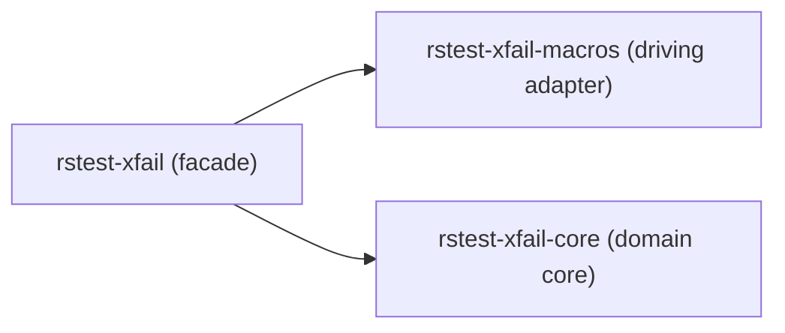

# Convert the crate into a Cargo workspace (1.1.1)

This ExecPlan (execution plan) is a living document. The sections
`Constraints`, `Tolerances`, `Risks`, `Progress`, `Surprises & discoveries`,
`Decision log`, and `Outcomes & retrospective` must be kept up to date as work
proceeds.

Status: DRAFT

This plan delivers roadmap task **1.1.1** (see [roadmap](../roadmap.md) §1.1).
It converts the single-package `rstest-xfail` crate into a three-crate Cargo
workspace. It does **not** implement the classifier vocabulary (roadmap 1.2.x),
the `#[xfail]` macro behaviour (roadmap 2.1.x), or the strictness and async
Architecture Decision Records (roadmap 1.1.2 and 1.1.3). Those are separate
tasks and are explicitly out of scope.

## Signposts: documents and skills

Read these before starting. They are the source of truth for this work.

- [Technical design](../xfail-design.md) §§5-6 — the three-crate architecture
  and the core crate contract this plan realizes.
- [Roadmap](../roadmap.md) §1.1.1 — the task definition and success criterion.
- [Repository layout](../repository-layout.md) — the canonical tree this plan
  updates.
- [Developer guide](../developers-guide.md) — the local workflow and `make`
  targets.
- [Documentation style guide](../documentation-style-guide.md) — spelling
  (en-GB-oxendict), Markdown rules, and ADR conventions used here.
- [AGENTS.md](../../AGENTS.md) — code style, testing mandate, dependency
  policy, and commit gates.

Relevant skills (load with the `rust-router` skill as the entry point):

- `arch-crate-design` — crate boundaries, workspace structure, feature flags,
  public versus internal surface.
- `arch-decision-records` — the format for the workspace boundary decision.
- `rust-unit-testing` — `rstest` fixtures, table tests, `serial_test`
  isolation, and rich assertions with `googletest`, `pretty_assertions`, and
  `insta`.
- `hexagonal-architecture` — to protect the core and adapter boundary without
  transplanting ceremony.
- `execplans` — the format and discipline this document follows.
- `pr-creation` — the draft pull-request conventions used to deliver this work.

## Purpose / big picture

After this change, the repository is a Cargo workspace with three member
crates rather than one package:

- `rstest-xfail-core` — the domain library that will own the outcome and
  policy vocabulary and the classification functions (design §6). It is pure:
  it depends on neither sibling crate nor on any procedural-macro tooling.
- `rstest-xfail-macros` — a procedural-macro crate that will parse `#[xfail]`
  and rewrite annotated functions (design §7). It is the driving adapter.
- `rstest-xfail` — the facade crate that users name in their manifest. It
  re-exports the `#[xfail]` attribute, and at this task nothing else (design
  §5).

At this task the three crates hold documented placeholders only. The
observable success is structural and is exactly the roadmap criterion: running
`cargo metadata` lists all three workspace members, and the facade re-exports
only the intended public surface. A reader can confirm both without inspecting
any implementation.

This split is the foundation for everything downstream. It is the single
decision that lets `rstest-bdd` consume classification semantics from
`rstest-xfail-core` without pulling in procedural-macro expansion machinery
(design §5).

## Constraints

Hard invariants. Violation requires escalation, not a workaround.

- **D1 — core purity.** `rstest-xfail-core` must not depend on
  `rstest-xfail-macros` or `rstest-xfail`, and must not list `proc-macro2`,
  `syn`, or `quote` among its dependencies, directly or through a feature. The
  dependency arrows point one way only: `rstest-xfail` depends on both
  siblings, and `rstest-xfail-macros` may depend on `rstest-xfail-core`. The
  core depends on neither. This is gated by an automated test (see Concrete
  steps), not only a manual command.
- **C-SURFACE-1 — placeholder surface only.** The facade re-exports only the
  placeholder `#[xfail]` attribute. The core exposes no public items at 1.1.1
  (only its crate-level documentation), so no fictitious type is locked into the
  public surface. No classifier types, no macro argument parsing or function
  rewriting. Every module begins with a `//!` comment and every public item
  carries `///` docs, because the inherited `missing_docs` and
  `missing_crate_level_docs` lints are set to `deny`.
- **C-DEPS-1 — no new runtime dependencies.** This task adds only *path*
  dependencies between the three members. No new crates.io *runtime* dependency
  enters any manifest. Test-only `dev-dependencies` (such as `rstest`, `insta`,
  `serde_json`, and `serial_test`) are expected and permitted. Any new
  dependency uses a caret requirement (AGENTS.md "Dependency management").
- **C-LINTS-1 — lint policy preserved.** The current lint tables move into
  `[workspace.lints]` with zero net change to the enforced lint set, and every
  member sets `[lints] workspace = true`. `clippy.toml` stays at the workspace
  root, unchanged.
- **C-GREEN-1 — toolchain unchanged.** `rust-toolchain.toml`
  (`nightly-2026-05-28`) is not bumped by this task. The commit gate passes on
  the existing pinned toolchain.
- **C-SCOPE-1 — no downstream redesign.** Do not implement classifier types
  (1.2.x), macro behaviour (2.1.x), or the strictness and async ADRs (1.1.2,
  1.1.3). Do not restructure `docs/roadmap.md` beyond ticking the 1.1.1
  checkbox on completion.

## Tolerances (exception triggers)

Thresholds that trigger escalation. These bound autonomous action; they are
not quality criteria.

- **Scope.** Expect roughly three crate manifests, three crate roots, one
  virtual workspace manifest, the moved test, two new tests, the new ADR, and
  the documentation edits named below. If implementation requires net new
  source logic beyond documented placeholders, or touches more than the files
  listed in `Plan of work`, stop and escalate — logic leaking in from 1.2.x is
  a smell.
- **Interface.** The facade's intended public surface is fixed by this plan to
  the placeholder `#[xfail]` attribute re-exported from the macros crate. If a
  different surface seems necessary, stop and present options.
- **Dependencies.** If any *runtime* dependency (not a `dev-dependency`)
  appears necessary, stop and escalate (C-DEPS-1).
- **Iterations.** If the gate still fails after three focused attempts on the
  same cause, stop and escalate with the transcript.
- **Ambiguity.** If two valid interpretations materially change the outcome,
  stop and present them with trade-offs.

Stop-and-escalate triggers specific to this task:

- **T-STOP-1 (Cranelift).** If `rstest-xfail-macros` cannot build under the
  pinned nightly with the Cranelift codegen backend, and neither a per-package
  `codegen-backend` override nor an LLVM fallback resolves it without changing
  the toolchain or the continuous-integration (CI) Cranelift install, stop and
  escalate. Do not silently bump the toolchain or remove the Cranelift dev
  profile (Risk R1).
- **T-STOP-2 (lint regression).** If the `[workspace.lints]` migration cannot
  reproduce the current `cargo clippy --workspace` lint inventory exactly, stop
  and escalate rather than dropping a lint to make the build green (Risk R3).

## Risks

| Risk | Severity | Likelihood | Mitigation |
| --- | --- | --- | --- |
| R1. The Cranelift codegen backend cannot build the procedural-macro crate. `.cargo/config.toml` sets `[profile.dev] codegen-backend = "cranelift"` workspace-wide; procedural macros are host-compiled and Cranelift's procedural-macro coverage has historically lagged the LLVM backend. CI also installs Whitaker with `--cranelift`. | High | Medium | Validate a bare `proc-macro = true` crate under the pinned nightly first (Concrete steps, Stage B). On failure, scope the LLVM backend to only `rstest-xfail-macros` via `[profile.dev.package.rstest-xfail-macros] codegen-backend = "llvm"` in `.cargo/config.toml`. Escalate per T-STOP-1 if neither works. |
| R2. `public-api` / `cargo-public-api` rustdoc-JSON incompatibility with the pinned nightly, if adopted for the surface test. The tool consumes nightly rustdoc JSON whose format is unstable and version-locked, and `nightly-2026-05-28` may not match a published tool version. | Medium | Medium | This plan does **not** adopt `cargo-public-api` for 1.1.1 (see Decision log). The surface is documented with a lightweight reachability test plus an `insta` snapshot. A rigorous surface and SemVer lock is deferred to the publishing-boundary roadmap item. |
| R3. The lint-table migration to `[workspace.lints]` silently drops or mistypes a lint. The root manifest carries roughly fifty hand-maintained Clippy lines plus `[lints.rust]` and `[lints.rustdoc]`. | Medium | Medium | Move the tables verbatim. Diff the pre- and post-migration `cargo clippy --workspace` inventory. Confirm each member manifest carries `[lints] workspace = true`; an omission means that crate silently runs with default lints. Escalate per T-STOP-2. |
| R4. The Makefile `TARGET` and `build`/`release` rules reference a moved or renamed artefact. `TARGET ?= librstest-xfail.rlib` assumes a single root library, and a hyphenated crate actually produces `librstest_xfail.rlib`. | Medium | High | Repoint `TARGET` to `librstest_xfail.rlib` (the facade's artefact) and verify `make build`/`make release` produce it. The `test`, `coverage`, and `audit` targets already pass `--workspace` or derive the root from `cargo metadata` and need no change. |
| R5. The CI workflow assumes a single crate. `.github/workflows/ci.yml` drives everything through `make` (check-fmt, lint, audit, test, coverage). | Medium | Low | The Makefile targets already use `--workspace`/`--all-targets`, so CI inherits the R3/R4 fixes. Run the gate locally and confirm no workflow edit is needed; flag if the coverage action needs a workspace flag. |
| R6. Placeholder churn when 1.2.x and 2.1.x replace the skeleton. Placeholder roots and the moved `tests/stub.rs` will be rewritten within one or two tasks. | Low | High | Keep placeholders minimal and clearly marked disposable, mirroring the existing `tests/stub.rs` "delete this file" comment. Write no tests against placeholder *behaviour* beyond proving the no-op macro passes a body through; test only structure and reachability. Record that 1.2.1/2.1.1 must remove the stubs. |
| R7. Tests that shell out to `cargo metadata` from inside `cargo test`/`cargo nextest` contend on the package-cache lock and can stall or run nondeterministically under parallelism. | Medium | Medium | Use `cargo metadata --no-deps --offline` with `CARGO_NET_OFFLINE=1`, keep all metadata-spawning tests in one test binary, and serialize them with `serial_test`. If flakiness persists, consolidate the metadata read into a single fetch. |

*Table 1: Anticipated risks, with severity, likelihood, and mitigation for the
workspace conversion.*

Risks differ from surprises: risks are anticipated here; surprises are
recorded below as they emerge.

## Progress

- [ ] (pending) Stage A — orientation and manifest design ratified; this plan
  approved.
- [ ] (pending) Stage B — Cranelift procedural-macro spike passes; red tests in
  place and failing for the right reason.
- [ ] (pending) Stage C — workspace conversion implemented; red tests pass.
- [ ] (pending) Stage D — documentation, ADR, Makefile, and refactor complete;
  full gate green.
- [ ] (pending) `coderabbit review --agent` run and all concerns cleared.
- [ ] (pending) Roadmap 1.1.1 checkbox ticked in `docs/roadmap.md`.
- [ ] (pending) Draft pull request opened, titled with `(1.1.1)` and linking
  this execplan.

Replace `(pending)` with a UTC timestamp as each row completes, for example
`- [x] (2026-06-24 14:00Z) Stage B complete.` Split any partially completed row
into "done" and "remaining" rows at a stopping point.

## Surprises & discoveries

None yet. Record unexpected findings here with evidence and impact as work
proceeds. For example, confirm the exact rlib artefact name with
`ls target/debug/` after the first `make build` rather than assuming it, and
record the resolved `dev-dependency` versions once `cargo add` pins them.

## Decision log

- Decision: Use a **virtual workspace manifest** at the repository root with
  members under `crates/`.
  Rationale: the three crates are peers; none should own the root. Making the
  facade the root package would force the core and macros crates into
  sub-paths of the facade, which is misleading because the core has no
  dependency on the facade. A virtual manifest keeps the root free of package
  identity. The `crates/` directory is the conventional uniform home and
  matches the generic `cargo metadata` walk already used by `make audit`.
  Date/Author: 2026-06-24, planning team.
- Decision: **Expose no public item from `rstest-xfail-core` at 1.1.1**; the
  facade re-exports only the placeholder `#[xfail]` attribute.
  Rationale: design §14 lists "whether the facade re-exports all core types or
  only stable policy constructors" as an open question. Inventing a placeholder
  core type to re-export would prejudge that decision and lock a meaningless
  item into the public surface that the snapshot test then advertises as the
  contract. The roadmap criterion's "intended public surface" at 1.1.1 is the
  `#[xfail]` attribute alone. The facade still declares a path dependency on
  `rstest-xfail-core` to establish the intended dependency graph; that edge is
  verified by the D1 metadata test even though no public re-export exists yet.
  Date/Author: 2026-06-24, planning team and review panel.
- Decision: Ship a **no-op `#[xfail]` placeholder attribute** in the macros
  crate, and prove it passes a body through unchanged.
  Rationale: `#[xfail]` is the facade's intended surface, and a
  `proc-macro = true` crate must export a macro to be exercised at all. A no-op
  also de-risks R1. The design forbids a rewritten body from ever masking its
  real outcome, so the placeholder test annotates a function with an observable
  body and asserts the body still runs, proving the no-op does not absorb the
  outcome. Argument parsing remains deferred to 2.1.1.
  Date/Author: 2026-06-24, planning team and review panel.
- Decision: Document the facade surface with a **lightweight reachability test
  plus an `insta` snapshot**, not `cargo-public-api`.
  Rationale: `cargo-public-api` consumes nightly rustdoc JSON whose format is
  version-locked, and the repository pins a specific nightly; coupling a
  published tool version to that nightly is brittle for a surface of one
  placeholder attribute. The snapshot is a hand-maintained record of *intent*
  for reviewers, not an automated completeness guarantee — it cannot detect an
  unintended re-export that is also added to the constant. A rigorous surface
  and SemVer lock belongs at the publishing boundary in a later roadmap item.
  Date/Author: 2026-06-24, planning team and review panel.
- Decision: Add a minimal **ADR
  `adr-001-cargo-workspace-and-crate-boundaries`** now.
  Rationale: the crate boundary is substantive and hard to reverse, and it is
  cited by every later task and by downstream `rstest-bdd` work. AGENTS.md and
  the style guide both call for capturing a substantive decision in an ADR
  referenced from the design document. No ADR exists yet, so `adr-001` is the
  correct next sequence number; ADR numbers are assigned in creation order and
  this plan does not reserve numbers for the 1.1.2 and 1.1.3 ADRs.
  Date/Author: 2026-06-24, planning team and review panel.
- Decision: Enforce the red stage with a **compile-fail import and a value
  diff**, recording the observable substitute, because Rust's stable test
  harness has no strict expected-failure marker for these reds.
  Rationale: the `execplans` skill asks for a strict expected-failure marker
  where the framework supports one, or a documented substitute otherwise. The
  reachability red is a `cargo`-refused import (`unresolved import
  rstest_xfail::xfail`) and the member-set red is the diff
  `left: {"rstest-xfail"}` against the three-member set; both are
  deterministic and observable.
  Date/Author: 2026-06-24, review panel.
- Decision: Set **`resolver = "3"`** in the virtual manifest and verify it with
  `cargo metadata` immediately after writing the manifest.
  Rationale: a virtual manifest has no package edition to infer the resolver
  from, so the resolver must be set explicitly; edition 2024 corresponds to
  resolver 3. The pinned nightly Cargo accepts resolver 3. The verification
  step (Concrete steps, Stage C) catches any toolchain mismatch on the very
  first `cargo metadata` rather than later.
  Date/Author: 2026-06-24, review panel.

## Context and orientation

The reader is assumed to know nothing of this repository. The current state is
a single Cargo package.

- `Cargo.toml` (root) declares `package.name = "rstest-xfail"`, edition 2024,
  version 0.1.0, and licence ISC. It carries large lint tables:
  `[lints.clippy]` (roughly fifty entries, including `pedantic` at `warn` with
  `priority = -1` and many restriction lints set to `deny`), `[lints.rust]`
  with `missing_docs = "deny"`, and `[lints.rustdoc]` with
  `missing_crate_level_docs = "deny"`.
- `src/lib.rs` is a stub exposing `pub const fn greet() -> &'static str`.
- `tests/stub.rs` is a disposable integration test that only checks
  `CARGO_MANIFEST_DIR` is set. Its own module comment says to delete it once
  real tests exist.
- `clippy.toml` sets tight thresholds and `allow-expect-in-tests = true`. This
  means `.expect(...)` is permitted inside `#[test]` and `#[cfg(test)]` code,
  but `.unwrap()` is denied everywhere and helpers outside test scope must
  return `Result` and use `?` rather than panicking (AGENTS.md "Error
  handling").
- `.cargo/config.toml` enables the unstable `codegen-backend` feature and sets
  `[profile.dev] codegen-backend = "cranelift"`, plus a `mold` linker
  configuration for Linux.
- `rust-toolchain.toml` pins `nightly-2026-05-28` with the `clippy`,
  `llvm-tools-preview`, `rustc-codegen-cranelift-preview`, and `rustfmt`
  components.
- `Makefile` is the public entrypoint. `make check-fmt`, `make lint`, and
  `make test` are the commit gates; `make all` runs the three in sequence.
  `make test` prefers `cargo nextest run` and also runs `cargo test --doc
  --workspace --all-features`. `make markdownlint`, `make nixie`, and
  `make audit` are separate targets, not part of `make all`. `make audit`
  derives the workspace root with `cargo metadata --no-deps --format-version 1`
  and runs `cargo audit` once at the root. The `build` and `release` targets
  build a file named by `TARGET ?= librstest-xfail.rlib`.
- `.github/workflows/ci.yml` runs everything through `make` (check-fmt,
  markdownlint, audit, lint, and a coverage action). It never invokes
  `make build` or `make release`.

Terms used in this plan:

- **Virtual manifest** — a root `Cargo.toml` with a `[workspace]` table but no
  `[package]` table. It owns no source code.
- **Facade crate** — the user-facing crate that re-exports the public surface
  of the other crates so users depend on one name.
- **Driving adapter** — code that translates external input (here, the
  `#[xfail]` attribute) into calls on the domain core.

### Hexagonal mapping

The ports-and-adapters lens protects the boundary; it is not a ceremony to
transplant. There are no `ports/` module trees at this stage because there is
no logic to wrap yet.

- **Domain core** — `rstest-xfail-core`. The hexagon interior. It will own the
  classification vocabulary and the `IntoBodyOutcome` seam (design §6.1). At
  1.1.1 it is a documented placeholder with no public items.
- **Driving adapter** — `rstest-xfail-macros`. Translates the user's attribute
  into calls on the core's inbound boundary (in a later task).
- **Composition root** — `rstest-xfail`. Wires the adapter to the core through
  re-exports.
- **Driven side** — none yet. The design keeps harness reporting in adapters,
  not the core (design §11), and `rstest-bdd` is a separate downstream
  consumer, out of scope here.

For screen readers: the following diagram shows the three crates as boxes with
arrows from the facade to both the macros crate and the core crate. The core
has no outgoing arrows, expressing constraint D1. The macros-to-core arrow
arrives only in roadmap 2.1.x and is therefore not drawn.



*Figure 1: The 1.1.1 dependency arrows. The core is a pure leaf; the
macros-to-core edge is deferred to 2.1.x.*

Constraint D1 is the enforceable form of this mapping.

## Interfaces and dependencies

At the end of this task the following must exist.

The repository root `Cargo.toml` is a virtual workspace manifest:

```toml
[workspace]
resolver = "3"
members = [
    "crates/rstest-xfail-core",
    "crates/rstest-xfail-macros",
    "crates/rstest-xfail",
]

[workspace.package]
version = "0.1.0"
edition = "2024"
license = "ISC"
repository = "https://github.com/leynos/rstest-xfail"
homepage = "https://github.com/leynos/rstest-xfail"
readme = "README.md"
keywords = ["rust", "testing", "macros", "unit-tests"]
categories = ["development-tools"]

[workspace.dependencies]
rstest-xfail-core = { path = "crates/rstest-xfail-core", version = "0.1.0" }
rstest-xfail-macros = { path = "crates/rstest-xfail-macros", version = "0.1.0" }

[workspace.lints.clippy]
pedantic = { level = "warn", priority = -1 }

# 1. hygiene
allow_attributes                    = "deny"
allow_attributes_without_reason     = "deny"
blanket_clippy_restriction_lints    = "deny"
cognitive_complexity                = "deny"
needless_pass_by_value              = "deny"
implicit_hasher                     = "deny"

# 2. debugging leftovers
dbg_macro                           = "deny"
print_stdout                        = "deny"
print_stderr                        = "deny"

# 2. panic-prone operations
unwrap_used                         = "deny"
expect_used                         = "deny"
indexing_slicing                    = "deny"
string_slice                        = "deny"
integer_division                    = "deny"
integer_division_remainder_used     = "deny"
panic_in_result_fn                  = "deny"
unreachable                         = "deny"

# 4. portability
host_endian_bytes                   = "deny"
little_endian_bytes                 = "deny"
big_endian_bytes                    = "deny"

# 5. nursery idiom polish
let_underscore_must_use             = "deny"
or_fun_call                         = "deny"
option_if_let_else                  = "deny"
self_named_module_files             = "deny"
shadow_reuse                        = "deny"
shadow_same                         = "deny"
shadow_unrelated                    = "deny"
str_to_string                       = "deny"
string_lit_as_bytes                 = "deny"
try_err                             = "deny"
unneeded_field_pattern              = "deny"
use_self                            = "deny"

# 6. numerical foot-guns
float_arithmetic                    = "deny"
cast_possible_truncation            = "deny"
cast_possible_wrap                  = "deny"
cast_precision_loss                 = "deny"
lossy_float_literal                 = "deny"

# 7. API ergonomics
missing_const_for_fn                = "deny"
must_use_candidate                  = "deny"
unused_async                        = "deny"

# 8. Error handling
missing_panics_doc                  = "deny"
error_impl_error                    = "deny"
result_large_err                    = "deny"

[workspace.lints.rust]
missing_docs                        = "deny"

[workspace.lints.rustdoc]
missing_crate_level_docs            = "deny"
```

The `[workspace.lints.*]` tables are the current root `[lints.*]` tables
copied verbatim, with only the table header gaining the `workspace.` prefix.
The `priority = -1` on `pedantic` is preserved so the explicit per-lint `deny`
entries override the group `warn`. The `authors`, `description`, and
`rust-version` keys are intentionally not added to `[workspace.package]`
because the current manifest does not set them and each crate carries its own
`description`.

The member manifest `crates/rstest-xfail-core/Cargo.toml`:

```toml
[package]
name = "rstest-xfail-core"
description = "Outcome and policy types and runtime classification for rstest-xfail"
version.workspace = true
edition.workspace = true
license.workspace = true
repository.workspace = true
homepage.workspace = true
readme.workspace = true
keywords.workspace = true
categories.workspace = true

[dependencies]

[lints]
workspace = true
```

The member manifest `crates/rstest-xfail-macros/Cargo.toml`:

```toml
[package]
name = "rstest-xfail-macros"
description = "Procedural macro implementation of the #[xfail] attribute for rstest-xfail"
version.workspace = true
edition.workspace = true
license.workspace = true
repository.workspace = true
homepage.workspace = true
readme.workspace = true
keywords.workspace = true
categories.workspace = true

[lib]
proc-macro = true

[dependencies]

[lints]
workspace = true
```

The member manifest `crates/rstest-xfail/Cargo.toml`:

```toml
[package]
name = "rstest-xfail"
description = "Expected failure macro attributes for rstest, async tests and rstest-bdd"
version.workspace = true
edition.workspace = true
license.workspace = true
repository.workspace = true
homepage.workspace = true
readme.workspace = true
keywords.workspace = true
categories.workspace = true

[dependencies]
# Public re-exports of core types arrive in roadmap 1.2.x; the dependency edge
# is declared now to establish the intended workspace graph (verified by D1).
rstest-xfail-core.workspace = true
rstest-xfail-macros.workspace = true

[dev-dependencies]
rstest = "0.23"
googletest = "0.13"
pretty_assertions = "1"
insta = "1"
serde_json = "1"
serial_test = "3"

[lints]
workspace = true
```

Resolve the `dev-dependencies` to current caret versions at implementation
time with `cargo add --dev rstest googletest pretty_assertions insta serde_json
serial_test`, then record the resolved versions in `Surprises & discoveries`.
The string form `insta::assert_snapshot!` used below needs no `insta` feature
flag; do not add one. No feature flag is required for the `googletest`
matchers `contains`, `eq`, and `not`.

The crate roots expose exactly these public items.

`crates/rstest-xfail-core/src/lib.rs` (no public items; crate documentation
only):

```rust
//! Core outcome and policy types and runtime classification for `rstest-xfail`.
//!
//! This crate is an intentional placeholder while the workspace skeleton is
//! established. It exposes no public items yet. The classification vocabulary
//! described in the design (`XfailPolicy`, `BodyOutcome`, and related types)
//! arrives in a later task (roadmap 1.2.x), at which point the facade's
//! re-export scope (design §14) is decided.
```

`crates/rstest-xfail-macros/src/lib.rs`:

```rust
//! Procedural macro implementation for `rstest-xfail`.
//!
//! This crate currently provides a no-op placeholder `#[xfail]` attribute so
//! the workspace skeleton links and the facade can re-export the attribute. The
//! real argument parsing and function rewriting described in the design arrive
//! in a later task.

use proc_macro::TokenStream;

/// Placeholder `#[xfail]` attribute macro.
///
/// For now it returns the annotated item unchanged. It must never absorb or
/// alter the body: a passing body still passes and a failing body still fails.
/// The real implementation (roadmap 2.1.x) will parse `reason`, `strict`,
/// `mode`, and `contains`, then rewrite the function body to classify its
/// outcome.
#[proc_macro_attribute]
pub fn xfail(_args: TokenStream, item: TokenStream) -> TokenStream { item }
```

`crates/rstest-xfail/src/lib.rs`:

```rust
//! Expected-failure macro attributes for `rstest`, async tests, and
//! `rstest-bdd`.
//!
//! This facade re-exports the public surface intended for ordinary users. At
//! the workspace-skeleton phase that surface is the single placeholder
//! `#[xfail]` attribute from `rstest-xfail-macros`. The stable types from
//! `rstest-xfail-core` are re-exported once they exist (roadmap 1.2.x).

pub use rstest_xfail_macros::xfail;
```

This is the entire facade surface: one macro re-export. A `pub use` re-export
does not need its own `///` doc, so `missing_docs` is satisfied by the
documentation on the original item.

## Plan of work

Work proceeds in four stages with go/no-go validation at each boundary. Commit
after each green stage.

### Stage A — understand and propose (no code changes)

Read the signposted documents. Confirm the manifest and surface design above
against the current `Cargo.toml`, `Makefile`, and `.cargo/config.toml`. This
plan is the Stage A artefact; it must be approved before Stage B (see
`Approval gate` in the `execplans` skill).

### Stage B — de-risk and write red tests

This stage is partly a prototyping milestone (the Cranelift spike) and partly
the Red step of Red-Green-Refactor.

First, de-risk R1: prove a `proc-macro = true` crate builds under the pinned
nightly with the Cranelift dev profile (Concrete steps). If it fails, apply the
fallback and re-run; if the fallback also fails, stop (T-STOP-1).

Then establish the red tests against the *current* single-package layout so
they fail for the right reason before the workspace exists. Add the test-only
`dev-dependencies` to the current root `Cargo.toml`, then:

- Add `tests/workspace_members.rs` in its final form (Concrete steps). Against
  the single package, `cargo metadata` reports one member, so the set assertion
  fails with the diff `left: {"rstest-xfail"}` — not a parse error.
- Add a *minimal* `tests/public_surface.rs` containing only `use
  rstest_xfail::xfail;` and a trivial test that applies `#[xfail]`. Against the
  current crate, `rstest_xfail::xfail` does not exist, so it fails to compile
  with `unresolved import rstest_xfail::xfail`, the correct red for a
  reachability contract. The snapshot and body-pass-through assertions are
  added in Stage D, not now.

### Stage C — implement the workspace (minimal change to go green)

1. Create the three member directories under `crates/` with the manifests and
   crate roots from `Interfaces and dependencies`. Author the files directly at
   the quoted paths; do not use `cargo new`, because the manifests are bespoke
   (inherited metadata and lints).
2. Rewrite the root `Cargo.toml` into the virtual workspace manifest, migrating
   the lint tables and package metadata, and move the test-only
   `dev-dependencies` from the root into `crates/rstest-xfail/Cargo.toml`.
3. Run `cargo metadata --no-deps --offline --format-version 1` to confirm the
   virtual manifest and `resolver = "3"` are accepted before going further.
4. Delete the root `src/lib.rs` and remove the root `src/` directory.
5. Move `tests/stub.rs` to `crates/rstest-xfail/tests/stub.rs` unchanged, and
   move `tests/workspace_members.rs` and `tests/public_surface.rs` to
   `crates/rstest-xfail/tests/`. Remove the now-empty root `tests/` directory.

Both red tests now pass. Run `make test` to confirm.

### Stage D — refactor, document, and finalize

1. Repoint the Makefile `TARGET` default to `librstest_xfail.rlib` and confirm
   `make build` and `make release` produce that artefact.
2. Expand `crates/rstest-xfail/tests/public_surface.rs` to its final form (the
   `insta` snapshot plus the body-pass-through assertion) and generate the
   snapshot. Add the `rstest` parameterized presence test and the D1 purity
   test to `crates/rstest-xfail/tests/workspace_members.rs`.
3. Write `docs/adr-001-cargo-workspace-and-crate-boundaries.md`.
4. Update `docs/repository-layout.md`, `docs/developers-guide.md`,
   `docs/contents.md`, and add the one-line realization note plus ADR
   reference to `docs/xfail-design.md` §5.
5. Run the full gate (`make check-fmt`, `make lint`, `make test`,
   `make markdownlint`, `make nixie`, `make audit`), then
   `coderabbit review --agent`, and clear all concerns.
6. Tick the 1.1.1 checkbox in `docs/roadmap.md` (the `- [ ] 1.1.1.` line).
7. Open a draft pull request titled
   `Convert the crate into a Cargo workspace (1.1.1)` whose body links this
   execplan and the roadmap §1.1.1 item, following the `pr-creation` skill.

## Concrete steps

All commands run from the repository root unless stated otherwise.

### Cranelift procedural-macro validation and fallback

After the macros crate skeleton exists:

```text
cargo +nightly-2026-05-28 build -p rstest-xfail-macros
cargo +nightly-2026-05-28 build -p rstest-xfail
cargo +nightly-2026-05-28 test -p rstest-xfail --no-run
```

All three use the dev profile and therefore exercise Cranelift on the
procedural-macro crate. If any fail with a codegen-backend error, add the
following to `.cargo/config.toml` and re-run, so only the macros crate uses the
LLVM backend:

```toml
[profile.dev.package.rstest-xfail-macros]
codegen-backend = "llvm"
```

Apply this override only if validation fails; do not add it pre-emptively.

### The member-set and core-purity tests

`crates/rstest-xfail/tests/workspace_members.rs` (final form):

```rust
//! End-to-end checks over `cargo metadata` for roadmap task 1.1.1: the
//! workspace exposes exactly the three intended members, and the core crate
//! depends on none of its siblings or on procedural-macro tooling (constraint
//! D1). These shell out to `cargo metadata`, so they are serialized to bound
//! package-cache lock contention.

use std::{collections::BTreeSet, process::Command};

use googletest::prelude::{contains, eq, not, verify_that};
use rstest::rstest;
use serial_test::serial;

/// Runs `cargo metadata` and returns the parsed JSON document.
///
/// Returns `Result` so the helper stays outside the `expect`-in-tests
/// allowance; helpers must propagate errors rather than panic. `--offline` and
/// `CARGO_NET_OFFLINE` avoid any registry refresh and reduce lock contention.
fn workspace_metadata() -> Result<serde_json::Value, Box<dyn std::error::Error>> {
    let cargo = std::env::var("CARGO").unwrap_or_else(|_| "cargo".to_owned());
    let output = Command::new(cargo)
        .args(["metadata", "--no-deps", "--offline", "--format-version", "1"])
        .env("CARGO_NET_OFFLINE", "1")
        .output()?;
    if !output.status.success() {
        return Err(format!(
            "cargo metadata failed: {}",
            String::from_utf8_lossy(&output.stderr)
        )
        .into());
    }
    Ok(serde_json::from_slice(&output.stdout)?)
}

/// Extracts the set of member package names from a `cargo metadata` document.
///
/// Indexing a `serde_json::Value` is panic-free: a missing key yields
/// `Value::Null`, which `as_array` then reports as `None`. This is a
/// third-party `Index` impl and is not flagged by `clippy::indexing_slicing`.
fn member_names(
    metadata: &serde_json::Value,
) -> Result<BTreeSet<String>, Box<dyn std::error::Error>> {
    let member_ids: BTreeSet<&str> = metadata["workspace_members"]
        .as_array()
        .ok_or("workspace_members is not an array")?
        .iter()
        .filter_map(|id| id.as_str())
        .collect();
    let packages = metadata["packages"]
        .as_array()
        .ok_or("packages is not an array")?;
    let names = packages
        .iter()
        .filter(|pkg| pkg["id"].as_str().is_some_and(|id| member_ids.contains(id)))
        .filter_map(|pkg| pkg["name"].as_str().map(str::to_owned))
        .collect();
    Ok(names)
}

/// Reads a named package's declared dependency names from a metadata document.
fn declared_dependencies(
    metadata: &serde_json::Value,
    package: &str,
) -> Result<BTreeSet<String>, Box<dyn std::error::Error>> {
    let packages = metadata["packages"]
        .as_array()
        .ok_or("packages is not an array")?;
    let found = packages
        .iter()
        .find(|pkg| pkg["name"].as_str() == Some(package))
        .ok_or("package not found in metadata")?;
    let deps = found["dependencies"]
        .as_array()
        .ok_or("dependencies is not an array")?
        .iter()
        .filter_map(|dep| dep["name"].as_str().map(str::to_owned))
        .collect();
    Ok(deps)
}

#[test]
#[serial]
fn workspace_has_exactly_three_intended_members()
-> Result<(), Box<dyn std::error::Error>> {
    use pretty_assertions::assert_eq;

    let metadata = workspace_metadata()?;
    let actual = member_names(&metadata)?;
    let expected: BTreeSet<String> =
        ["rstest-xfail", "rstest-xfail-core", "rstest-xfail-macros"]
            .into_iter()
            .map(str::to_owned)
            .collect();

    assert_eq!(actual, expected, "workspace member set must match exactly");
    Ok(())
}

#[test]
#[serial]
fn core_has_no_forbidden_dependencies()
-> Result<(), Box<dyn std::error::Error>> {
    let metadata = workspace_metadata()?;
    let deps = declared_dependencies(&metadata, "rstest-xfail-core")?;
    for forbidden in ["rstest-xfail-macros", "rstest-xfail", "syn", "quote", "proc-macro2"] {
        verify_that!(&deps, not(contains(eq(forbidden.to_owned()))))?;
    }
    Ok(())
}

#[rstest]
#[case("rstest-xfail-core")]
#[case("rstest-xfail-macros")]
#[case("rstest-xfail")]
fn each_intended_member_is_present(
    #[case] expected: &str,
) -> Result<(), Box<dyn std::error::Error>> {
    let metadata = workspace_metadata()?;
    let names = member_names(&metadata)?;
    verify_that!(names, contains(eq(expected.to_owned())))?;
    Ok(())
}
```

The matchers are imported narrowly (`contains`, `eq`, `not`, `verify_that`)
rather than via `use googletest::prelude::*`, because the glob brings a
single-parameter `Result` alias into scope that would clash with the two-
parameter `Result<_, Box<dyn std::error::Error>>` helper signatures. `--no-deps`
keeps each package's declared `dependencies` array available while omitting the
resolved graph, which is what both the member-set and D1 checks need.

### The facade public-surface test

`crates/rstest-xfail/tests/public_surface.rs` (final form, added in Stage D):

```rust
//! Documents the facade's public surface for roadmap task 1.1.1.
//!
//! It asserts reachability — the intended public item resolves through the
//! `rstest_xfail` facade path — and records the intended surface as a
//! reviewer-facing `insta` snapshot. The snapshot is a hand-maintained record
//! of intent, not an automated completeness guarantee: it cannot detect an
//! unintended re-export that is also added to the constant. A rigorous surface
//! and SemVer lock is deferred to the publishing-boundary roadmap item. There
//! is no classifier behaviour at this stage (roadmap 1.2.x); this test
//! validates structure only.

use rstest_xfail::xfail;

/// The facade's intended public surface, one path per line, sorted. Update this
/// list and review the snapshot only when the public contract intentionally
/// changes.
const INTENDED_PUBLIC_SURFACE: &str = "rstest_xfail::xfail";

#[test]
fn facade_public_surface_is_documented() {
    insta::assert_snapshot!("facade_public_surface", INTENDED_PUBLIC_SURFACE);
}

// Applying the placeholder attribute proves it is reachable through the facade
// and, critically, that the no-op passes the body through unchanged rather than
// absorbing it. The design forbids a rewritten body from ever masking its real
// outcome; 2.1.x replaces this no-op before any classification logic exists.
#[xfail]
fn annotated_body_runs() -> i32 { 2 + 2 }

#[test]
fn placeholder_macro_passes_body_through() {
    use pretty_assertions::assert_eq;

    assert_eq!(annotated_body_runs(), 4);
}
```

Generate the snapshot once with
`INSTA_UPDATE=always cargo test -p rstest-xfail --test public_surface` (or
`cargo insta accept`), review the emitted file, and commit it. Do not
hand-author the snapshot header; let `insta` write
`crates/rstest-xfail/tests/snapshots/public_surface__facade_public_surface.snap`
and review only that its payload reads `rstest_xfail::xfail`. The one-line
surface is intentionally tiny at 1.1.1 and grows in later tasks; it is not an
incomplete test.

### Test-tool applicability

These deferrals are deliberate scoping, not omissions.

- `rstest` — applies; used for the parameterized presence test.
- `rstest-bdd` — deferred. There is no runtime behaviour to narrate as
  Given/When/Then; the `cargo metadata` end-to-end test is the correct
  observable check. Revisit when `#[xfail]` produces user-visible outcomes
  (2.x).
- `proptest` — deferred. A fixed three-member set has no input domain over
  which a property holds.
- `kani` — deferred. There is no `unsafe` code or state machine to model-check;
  the contract is enforced by Cargo's resolver and rustc's import resolution.
- `verus` — deferred. There is no function or lemma to prove; a proof here
  would restate an assumed property, which AGENTS.md disallows.

### The ADR

Create `docs/adr-001-cargo-workspace-and-crate-boundaries.md` following the
style guide's required ADR sections. It records only the workspace and boundary
decision, not strictness (1.1.2) or async (1.1.3):

- **Status:** Accepted, 2026-06-24, "Adopt a three-crate Cargo workspace under
  `crates/` with a pure core".
- **Date:** 2026-06-24.
- **Context and problem statement:** the single crate cannot let downstream
  consumers (notably `rstest-bdd`) reuse classification logic without importing
  procedural-macro expansion machinery; design §5 mandates a split.
- **Decision outcome:** three crates — `rstest-xfail-core` (library),
  `rstest-xfail-macros` (procedural macro), `rstest-xfail` (facade) — under
  `crates/`, with a virtual workspace root, `[workspace.lints]` inheritance,
  and dependency rule D1.
- **Known risks and limitations:** the Cranelift-on-procedural-macro build
  risk (R1) and placeholder churn until 1.2.x (R6) are noted as follow-ups.
  The facade re-export scope (design §14) is recorded as a deferred decision,
  not decided here.

Add a one-line pointer to this ADR from `docs/xfail-design.md` §5 and link it
from `docs/contents.md` under a new `## Decision records` group.

### Documentation edits

- `docs/repository-layout.md` — replace the `src/` and `tests/` leaves with the
  `crates/*` subtree; restate the root `Cargo.toml` entry as the virtual
  workspace manifest; add per-crate path-responsibility bullets and the D1
  ownership boundary; restate the source and integration-test ownership rules
  per crate.
- `docs/developers-guide.md` — add a short "Workspace layout" note: three
  crates, `cargo` operates across all members by default, target one crate with
  `-p <crate>`, and lint and dependency policy are inherited from
  `[workspace.lints]` and `[workspace.dependencies]`.
- `docs/contents.md` — add an `## Execution plans` group listing this plan, and
  a `## Decision records` group listing the new ADR.
- `docs/xfail-design.md` — add one informative sentence at the top of §5
  noting the skeleton is realized by this plan and crate roots are placeholders
  until 1.2.x/2.1.x; do not alter the normative crate table.
- `docs/users-guide.md` — no change. It documents `make` targets in
  template-neutral language and names no crate or dependency snippet, and the
  facade crate name is unchanged from the current package name, so there is no
  user-visible API change at 1.1.1. Defer any user-guide note to the first task
  that ships real public API (2.1.x).

No Mermaid diagram is added to the edited documentation beyond Figure 1 in this
plan, so `make nixie` validates the existing diagram and passes. The optional
boundary diagram may be added with the ADR if a reviewer wants it, but it is
not required for 1.1.1.

## Validation and acceptance

Acceptance is phrased as observable behaviour. Run from the repository root.

Red-Green-Refactor evidence to record:

- **Red.** Before the `[workspace]` table exists,
  `cargo test --test workspace_members` fails with the member-set diff
  `left: {"rstest-xfail"}`, and `cargo test --test public_surface` fails to
  compile with `unresolved import rstest_xfail::xfail`. Rust's stable harness
  has no strict expected-failure marker for these reds, so the compile-fail
  import and the value diff are the observable substitutes (Decision log).
- **Green.** After Stage C, `make test` passes: the member-set test, the D1
  purity test, the three `rstest` cases, and the reachability test pass, and
  `cargo test --doc --workspace --all-features` passes.
- **Refactor.** After Stage D, the snapshot and body-pass-through assertions
  are added and the full gate stays green.

Quality criteria (what "done" means):

- **Tests.** `make test` exits 0. The `workspace_members` and `public_surface`
  tests pass; the disposable stub still passes; doctests pass.
- **Lint.** `make lint` exits 0 with no `unwrap_used`, `expect_used`,
  `missing_docs`, or `missing_crate_level_docs` diagnostics across all targets
  and features.
- **Format.** `make check-fmt` exits 0.
- **Markdown and diagrams.** `make markdownlint` and `make nixie` pass for the
  new and edited documentation.
- **Audit.** `make audit` runs once at the workspace root and passes.
- **Boundary (D1).** The `core_has_no_forbidden_dependencies` test passes, and
  `cargo tree -p rstest-xfail-core` shows no dependency on
  `rstest-xfail-macros`, `rstest-xfail`, `syn`, `quote`, or `proc-macro2`.
- **CodeRabbit.** `coderabbit review --agent` reports no outstanding concerns,
  run only after the deterministic gates above are green.

The literal roadmap criterion, checkable without the test harness:

```text
cargo metadata --no-deps --offline --format-version 1 > /tmp/meta.json
python3 - <<'PY'
import json
meta = json.load(open("/tmp/meta.json"))
ids = set(meta["workspace_members"])
names = [p["name"] for p in meta["packages"] if p["id"] in ids]
print(sorted(names))
PY
```

Expected output:

```text
['rstest-xfail', 'rstest-xfail-core', 'rstest-xfail-macros']
```

Task 1.1.1 is done when this prints the three names; `make check-fmt`,
`make lint`, `make test`, `make markdownlint`, `make nixie`, and `make audit`
each exit 0; the `public_surface` snapshot reads only `rstest_xfail::xfail`;
and the D1 purity test passes.

## Idempotence and recovery

The conversion is a structural edit under version control, so recovery is
`git restore` or `git checkout` of the affected files. Each stage is committed
separately, so a failed stage can be rolled back without losing earlier work.
Re-running the validation commands is safe and non-destructive. The
`INSTA_UPDATE=always` snapshot creation is idempotent: re-running regenerates
the same snapshot from the same `INTENDED_PUBLIC_SURFACE` constant. The
Cranelift fallback edit to `.cargo/config.toml` is additive and can be removed
if a later toolchain fixes the backend.

## Artefacts and notes

Record the Cranelift spike result, the resolved `dev-dependency` versions, and
the first `make build` artefact name here as they are produced, so a future
reader does not have to re-derive them.

## Outcomes & retrospective

To be completed at task completion. Compare the result against the purpose:
three workspace members visible to `cargo metadata`, a facade exposing only the
intended surface, and a pure core satisfying D1. Note any deviation from this
plan and the reason, and any lesson for the 1.2.x and 2.1.x tasks that build on
this skeleton.

## Revision note

Initial draft, 2026-06-24. Authored from the technical design §§5-6, the
roadmap §1.1.1, and a planning team analysis covering the workspace manifest,
the test strategy, and the architecture, documentation, and risk surface, then
revised after a community-of-experts review. The review removed a fictitious
placeholder core type (it prejudged design §14), fixed two lint and
compilation defects in the test snippets (`unfulfilled_lint_expectations` on a
used import; a `Result` alias clash from a `googletest` glob import), added an
automated D1 purity gate, hardened the placeholder-macro test to prove genuine
body pass-through, corrected the red-stage sequencing, captioned the risk
table, added the draft-PR delivery step, and enumerated the actual gate set in
the acceptance criteria. No implementation has begun; the plan awaits approval
per the `Approval gate` discipline in the `execplans` skill.
